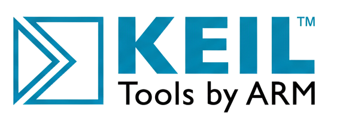
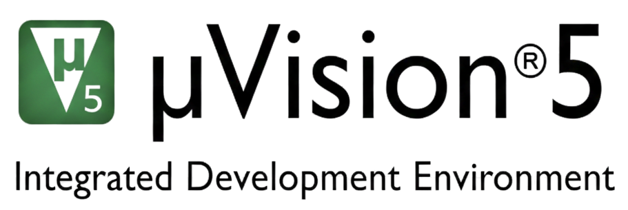

  
  

<h1 align="center">Embedded System Assembly 8051 Projects</h1>

  
  
  
  
  

---
## Introduction

This repository contains firmware developments and embedded system applications created that using the **8051 Instruction Set** and **Assembly language**, primarily focused on **Analog Devices ADuC841** microcontroller (MCUs) via **Keil µVision**.

## 📂 Projects

## ⚖️ License

This project is licensed under a **Creative Commons Attribution-NonCommercial-ShareAlike 4.0 International License**.

  

 
To view a copy of this license, visit <a href="http://creativecommons.org/licenses/by-nc-sa/4.0/">http://creativecommons.org/licenses/by-nc-sa/4.0/</a>.

## 🤝 Credits
All credits, references, and used standard 8051 instruction set components are listed within the individual project descriptions respectively.