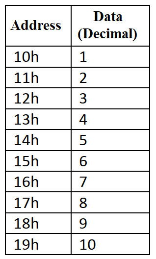

# Automated RAM Data Entry and Dynamic Summation

<p align="left">
  
  
  
</p>

---

## 📝 Overview
This project demonstrates sequential data writing and arithmetic processing within the **ADuC841** internal memory. The system first populates a RAM block (10h-19h) with decimal values using a loop. Subsequently, it retrieves these values to calculate their total sum using the `CJNE` instruction for iteration control, finally displaying the result on **Port 2**.



## 🎯 Objectives
* **Sequential Data Logging**: Populate RAM addresses 10h through 19h with values 1 to 10 respectively.
* **Dynamic Summation**: Calculate the mathematical sum of the previously stored data without using look-up tables.
* **Port Interfacing**: Output the final summation result to **Port 2** for hardware verification.
* **Loop Control**: Utilize the `CJNE` (Compare and Jump if Not Equal) instruction for precise loop termination.

## ⚙️ Hardware Configuration & Pin Mapping
The project utilizes internal CPU registers for calculation and a physical output port for the final result.

| Component | Pin / Port | Function |
| :--- | :--- | :--- |
| **Output Display** | **Port 2 (P2)** | Displays the 8-bit summation result. |

### Memory Mapping
| RAM Address | Initial Data (Decimal) |
| :--- | :--- |
| **10h - 19h** | Integer values from 1 to 10. |
| **Accumulator (A)** | Used for temporary storage and total sum calculation. |

## 🕹️ System Operation & Logic

1. **Data Initialization Phase**:
   - A pointer (**R0**) is initialized to **19h** (the end of the target RAM block).
   - Register **B** is loaded with **0Ah** (decimal 10) as the starting value.
   - The system populates the RAM in reverse order (from 19h down to 10h) by decrementing both the pointer and the value.

2. **Summation Phase**:
   - After the write phase, the pointer is incrementally reset to **10h**.
   - Data is retrieved using indirect addressing (**@R0**) and added to the **Accumulator (A)**.
   - The **CJNE** instruction ensures the loop iterates through all 10 addresses until the pointer reaches **1Ah**.

3. **Output Phase**:
   - The final calculated sum (55 decimal) is moved from the Accumulator to **Port 2** for external monitoring.

## ⏱️ Timer & Peripheral Specifications
* **CPU Cycle**: Standard high-speed execution; no hardware timers are required for this computational task.
* **Port 2 Configuration**: Operates in general-purpose I/O mode to drive potential LED indicators or monitoring equipment.

## 🏗️ Program Structure
* **`DATA_ENTRY`**: Initial loop to populate the RAM block.
* **`SUM_PROCESS`**: Calculation loop using indirect addressing to sum the RAM content.
* **`DISPLAY_STOP`**: Final stage to output data to P2 and enter an idle state.

## 💻 Source Code

> [!IMPORTANT]
> The following code is developed in 8051 Assembly for the Keil µVision environment. It follows the standard 8051 instruction set.

<details>
  <summary><b>📜 Click to View Source Code</b></summary>
  <br>

```assembly
; =============================================================================
; Project Name      : RAM Data Logging and Dynamic Summation
; Author            : Ali Ozkan
; Hardware          : ADuC841
; Description       : Writes values 1-10 to RAM 10h-19h and calculates their 
;                     sum using indirect addressing, outputting result to P2.
; =============================================================================

#include <ADUC841.H>

ORG 0000h
SJMP INIT

; -----------------------------------------------------------------------------
; INITIALIZATION & DATA ENTRY PHASE
; -----------------------------------------------------------------------------
INIT:
    MOV A, #00h                 ; Initialize Accumulator A with value 00h
    MOV B, #0Ah                 ; Initialize Register B with value 0Ah
    MOV R0, #19h                ; Initialize Register R0 with address 19h

WRITE_DATA:
    MOV @R0, B                  ; Move the value of Register B to the address pointed by R0
    DEC R0                      ; Decrement the value of Register R0 by 1
    DEC B                       ; Decrement the value of Register B by 1
    CJNE A, B, WRITE_DATA       ; Continue WRITE_DATA loop until A and B are equal

; -----------------------------------------------------------------------------
; DYNAMIC SUMMATION PHASE
; -----------------------------------------------------------------------------
SUM_DATA:
    INC R0                      ; Increment the value of Register R0 by 1
    MOV B, @R0                  ; Move value at address pointed by R0 to Register B
    ADD A, B                    ; Add values of A and B, store result in Accumulator A
    CJNE R0, #1Ah, SUM_DATA     ; Continue SUM_DATA loop until R0 reaches address 1Ah

; -----------------------------------------------------------------------------
; OUTPUT & TERMINATION
; -----------------------------------------------------------------------------
	MOV P2, A                   ; Output the final result in Accumulator A to Port 2

STOP:
    SJMP STOP                   ; Infinite loop to maintain the result display on P2

END
```

</details>

## 🧪 Simulation & Testing (Keil µVision)

1. **Debug Mode**: Start the simulation session by pressing `Ctrl + F5`.
2. **Memory View**: 
   - Open **View -> Memory Windows -> Memory 1**.
   - In the Address bar, type `D:0x10` and press Enter.
3. **Execution**: Press `F5` (Run) to execute the entire program instantly.
4. **Verification**:
   - **RAM Check**: Verify that addresses **10h through 19h** are populated with values **01 through 0A**.
   - **Result Check**: Open the Port 2 window (**Peripherals -> I/O Ports -> Port 2**). It should display **37h** (Hexadecimal for 55), confirming the successful summation.

## 🛠 Installation & Execution
1. Compile the code in Keil µVision and ensure the `.hex` file is generated.
2. Download the firmware to the ADuC841 using the **WSD Tool**.
3. Upon reset, the board will compute the sum and display `55` (in binary/hex format) on the LEDs connected to **Port 2**.