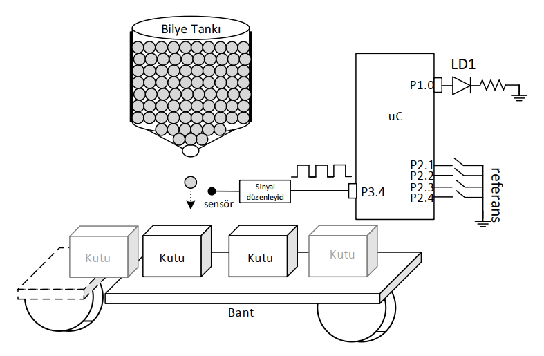

# Automated Ball Filling System with ADuC841

<p align="left">
  
  
  
</p>

---

## 📝 Overview
This project implements an automated industrial conveyor belt system designed to fill boxes with a specific number of steel balls (Bilye). The system utilizes the **ADuC841** microcontroller to count incoming balls via a sensor, compare the count against a user-defined reference value, and manage the process flow using precise timer interrupts. The entire firmware is developed in **8051 Assembly** to ensure low-level hardware control and timing accuracy.



## 🎯 Objectives
* **Real-time Counting:** Accurately count pulses from a sensor using **Timer 0** in 16-bit counter mode.
* **External Reference Integration:** Dynamically read the target number of balls (Reference) from external pins (P2.1 to P2.4) and store it in internal RAM (`20h`).
* **Visual Signaling:** Trigger a visual alert (LD1 LED) for exactly **0.5 seconds** using **Timer 2** when the target count is reached.
* **Batch Processing:** Automatically reset the counter and repeat the process for exactly **10 cycles** before safely terminating the program.
* **Modular Programming:** Implement the logic using a structured subroutine (Alt Program) architecture for clean and maintainable code.

## ⚙️ Hardware Configuration & Pin Mapping

The system utilizes specific specialized pins of the **ADuC841** to handle high-speed counting and precise timing. The pin assignments are as follows:

| Component | Pin / Port | Function | Description |
| :--- | :--- | :--- | :--- |
| **Ball Sensor** | **P3.4 (T0)** | Counter Input | Input for Timer 0 to count each ball falling into the box. |
| **Reference Inputs** | **P2.1 - P2.4** | Digital Input | Used to set the target number of balls externally. |
| **LD1 LED** | **P1.0** | Digital Output | Status indicator. Lights up for 0.5s when `BS = Reference`. |
| **Signal Conditioner** | Internal | Signal Prep | Rectifies sensor pulses for the MCU's T0 input. |

### Memory Mapping
* **Internal RAM Address `20h`**: Stores the **Reference** value read from Port 2.
* **Internal RAM Address `BS`**: Stores the current **Ball Count** (processed via Timer 0).

## 🕹️ System Operation & Logic

The system follows a cyclic execution flow to ensure precise control over the filling process. The core logic is structured as follows:

1.  **Initialization & Reference Input**:
    * The system reads the target value (Reference) from pins **P2.1 through P2.4**.
    * This value is moved to internal RAM address **20h** to serve as the comparison threshold.
    * **Timer 0** is initialized in 16-bit Counter Mode to track the sensor pulses from **P3.4**.

2.  **Counting & Comparison (BS = Referans)**:
    * The system continuously monitors the ball count (**BS**) via Timer 0.
    * Once the number of balls detected equals the value stored in **20h**, the system triggers the **LD1** indicator.

3.  **Timed Notification (0.5s Delay)**:
    * When the target is met, **LD1 (P1.0)** is pulled LOW/HIGH (depending on circuit) to turn on the LED.
    * **Timer 2** is utilized to create a precise **0.5-second delay**.
    * After the delay, the LED is turned off, and the system prepares for the next box.

4.  **Batch Counter & Termination**:
    * The system maintains a "Box Counter" in a designated register.
    * The entire process (Reset BS -> Read Reference -> Fill Box -> 0.5s LED) repeats **10 times**.
    * After the 10th box is successfully filled, the program enters a termination state (infinite loop or stop) to prevent further operation.

## ⏱️ Timer & Peripheral Specifications

The project utilizes the specialized timer architectures of the 8051 core to manage asynchronous events and precise time intervals simultaneously.

### 1. Timer 0: Ball Counter
* **Mode**: 16-bit Timer/Counter (Mode 1).
* **Clock Source**: External pulses from **P3.4 (T0 pin)**.
* **Function**: Configured as a counter to increment with every falling edge detected by the ball sensor.
* **Handling**: The count is monitored to trigger the comparison logic once it reaches the reference value.

### 2. Timer 2: Precision Delay (0.5s)
* **Mode**: 16-bit Auto-Reload Mode.
* **Clock Source**: Internal system clock.
* **Function**: Specifically dedicated to generating the **0.5-second duration** for the LD1 LED.
* **Advantage**: The auto-reload feature ensures timing consistency by automatically resetting the timer to its start value without CPU intervention after each overflow.

### 3. External Reference Logic (P2)
* **Input Handling**: Reading from Port 2 (P2.1-P2.4) allows for a 4-bit external reference value, providing a dynamic range for the target ball count.

## 🏗️ Program Structure

The software is designed using a **modular subroutine-based architecture** to ensure clarity and efficient execution. The program flow is divided into the following logical blocks:

* **`MAIN`**: The entry point where stack pointers, ports, and timers are initialized. It manages the global loop for the 10-box batch process.
* **`READ_REF`**: Subroutine dedicated to reading the 4-bit reference value from Port 2 and storing it in memory address `20h`.
* **`COUNT_PROCESS`**: The core loop that monitors Timer 0 (BS) and compares it with the reference value stored in RAM.
* **`DELAY_05S`**: A specialized subroutine using **Timer 2** in auto-reload mode to create a precise 0.5-second hold for the LED signal.
* **`RESET_SYSTEM`**: Handles the clearing of Timer 0 registers and internal counters to prepare for the next filling cycle.

## 💻 Source Code

> [!IMPORTANT]
> The following code is developed in 8051 Assembly for the Keil µVision environment. It follows the standard 8051 instruction set.

<details>
  <summary><b>📜 Click to View Source Code</b></summary>
  <br>

```assembly
; =============================================================================
; Project Name	: Automated Ball Filling System
; Author		: Ali Ozkan
; Hardware		: ADuC841 (8051 Instruction Set)
; Description	: Counts balls using Timer 0, compares with external reference,
;              	  and triggers a 0.5s LED alert using Timer 2 for 10 cycles.
; =============================================================================

#include <ADUC841.H>

ORG 0000h
SJMP INIT

; -----------------------------------------------------------------------------
; INITIALIZATION SECTION
; -----------------------------------------------------------------------------
INIT:
    MOV SP, #50h                ; Initialize Stack Pointer at address 50h
    CLR P1.0                    ; Ensure LD1 (P1.0) is OFF initially
    MOV P2, #0FFh               ; Configure Port 2 as Input for reference data
    MOV P3, #0FFh               ; Configure Port 3 as Input for sensor/reference

; -----------------------------------------------------------------------------
; MAIN PROGRAM LOOP
; -----------------------------------------------------------------------------
MAIN_LOGIC:
    ACALL TIMER_SETUP           ; Configure Timer 0 (Counter) and Timer 2 (Delay)
    ACALL REFERENCE_READ        ; Fetch target value from external pins
    MOV R0, #0Ah                ; Set Batch Counter to 10 (Process 10 boxes)
    MOV R2, #64h                ; Load delay multiplier for 0.5s (100 decimal)
    SETB TR0                    ; Enable Timer 0 to start counting sensor pulses

WAIT_FOR_TARGET:
    MOV A, TL0                  ; Fetch current ball count (BS) from Timer 0 Low Byte
    CJNE A, 20h, WAIT_FOR_TARGET ; Polling: Wait until BS equals Reference (stored in 20h)

    ACALL LED_NOTIFY            ; Target reached: Execute LED alert subroutine
    
    ; Resetting for the next box
    MOV TL0, #00h               ; Reset Timer 0 count
    MOV TH0, #00h               ; Clear High Byte for 16-bit consistency
    
    DJNZ R0, WAIT_FOR_TARGET    ; Repeat the process for the next box (up to 10)
    
    SJMP EXIT_PROC              ; Terminate after 10 boxes are filled

; -----------------------------------------------------------------------------
; SUBROUTINE: TIMER CONFIGURATION
; -----------------------------------------------------------------------------
TIMER_SETUP:
    ; TMOD: Set T0 to 16-bit Counter Mode (C/T=1, Mode 1)
    MOV TMOD, #05h              
    ; T2CON: Configure Timer 2 for Auto-Reload Mode
    MOV T2CON, #00h             
    
    ; Initialize Timer 0 (Counter) to 0
    MOV TL0, #00h
    MOV TH0, #00h
    
    ; Initialize Timer 2 for precise timing interval (5ms per overflow)
    ; Target 0.5s delay requires multiple overflows handled in LED_TIMER
    MOV TL2, #0FCh
    MOV TH2, #26h
    MOV RCAP2L, #0FCh
    MOV RCAP2H, #26h
RET

; -----------------------------------------------------------------------------
; SUBROUTINE: EXTERNAL REFERENCE READING
; -----------------------------------------------------------------------------
REFERENCE_READ:
    MOV A, P3                   ; Read Port 3 status
    ANL A, #1Eh                 ; Mask P3.1, P3.2, P3.3, and P3.4 bits
    RR A                        ; Align bits to retrieve 4-bit reference value
    MOV 20h, A                  ; Store the processed Reference value in RAM 20h
RET

; -----------------------------------------------------------------------------
; SUBROUTINE: LED ALERT CONTROL
; -----------------------------------------------------------------------------
LED_NOTIFY:
    SETB P1.0                   ; Turn ON LD1 LED
    ACALL DELAY_LOOP            ; Initiate 0.5s delay sequence
    CLR P1.0                    ; Turn OFF LD1 LED
RET

; -----------------------------------------------------------------------------
; SUBROUTINE: 0.5 SECOND DELAY (TIMER 2)
; -----------------------------------------------------------------------------
DELAY_LOOP:
    SETB TR2                    ; Start Timer 2

OVERFLOW_WAIT:
    JNB TF2, OVERFLOW_WAIT      ; Wait for Timer 2 Overflow Flag
    CLR TF2                     ; Clear Overflow Flag manually
    DJNZ R2, OVERFLOW_WAIT      ; Loop until 100 overflows occur (0.5s total)

    CLR TR2                     ; Stop Timer 2
    MOV R2, #64h                ; Reload R2 for the next box cycle
RET

EXIT_PROC:
    CLR TR0                     ; Stop all counters
    CLR TR2
    SJMP $                      ; End of program: Infinite loop

END
```

</details>

## 🧪 Simulation & Testing (Keil µVision)
To verify the logic without physical hardware, follow these steps in the Keil Simulator:

1.  **Enter Debug Mode**: Click **Debug -> Start/Stop Debug Session** (or press `Ctrl+F5`).
2.  **Open Peripheral Windows**:
    * Go to **Peripherals -> I/O Ports -> Port 3** (to simulate the sensor).
    * Go to **Peripherals -> I/O Ports -> Port 2** (to set the reference value).
    * Go to **Peripherals -> Timer / Counter -> Timer 0** (to monitor real-time register updates).
3.  **Simulate Ball Counting**: 
    * Ensure the **Timer 0** peripheral window is active.
    * Manually toggle the **P3.4** bit in the Port 3 window. 
    * Observe the real-time increment in the **TL0** register within the Timer 0 window as pulses are received.
4.  **Verify Logic**: Once **TL0** matches the value set in **P2 (Port 2)**, observe **P1.0 (LD1)** turning on for the 0.5s duration.

## 🛠 Installation & Execution

To run this project on your local machine or hardware, follow these steps:

1.  **Prerequisites**:
    * Install **Keil µVision 5.0** or later.
    * Ensure you have the **ADuC841 SDK/Configuration files** installed in Keil.
2.  **Project Setup**:
    * Clone this repository: `git clone https://github.com/aliozkanme/Embedded-System-Assembly-8051-Projects.git`
    * Navigate to the project folder and open the `.uvproj` file.
3.  **Compilation**:
    * Click on the **'Build'** button (or press F7) to compile the Assembly source code.
    * Verify that the `.hex` file is generated in the `Objects/` or `Output/` directory without errors.
4.  **Hardware Flashing**:
    * Connect your **ADuC841** board via a serial programmer.
    * Use the **WSD (Windows Serial Downloader)** or an equivalent tool to flash the `.hex` file.
    * Set the reference values via P2 and start the conveyor!