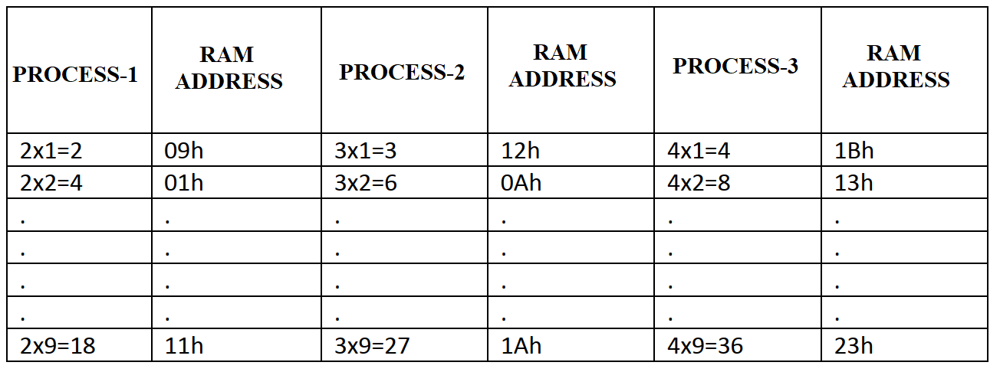

# Automated Multiplication Table Generator and RAM Mapping

<p align="left">
  
  
  
</p>

---

## 📝 Overview
This project focuses on internal data manipulation and memory management using the **ADuC841** microcontroller. 
The objective is to automate the generation of multiplication tables for the numbers 2, 3, and 4 using nested loops. Instead of driving external hardware, the results are calculated algorithmically and mapped to specific internal RAM addresses (09h to 23h). 
This serves as a fundamental exercise in understanding 8051 memory architecture and efficient loop control using the `CJNE` instruction.



## 🎯 Objectives
* **Internal RAM Management:** Perform organized data writing to specific memory locations (09h - 23h).
* **Automated Computation:** Implement nested loop structures to calculate multiplication tables for 2, 3, and 4.
* **Efficient Indexing:** Use indirect addressing or registers to dynamically point to memory addresses during the calculation.
* **Loop Control Mastery:** Execute precise iteration counts using `CJNE` and `DJNZ` instructions to ensure exact table generation.

## ⚙️ Hardware Configuration & Pin Mapping

Since this project focuses on internal data processing, physical pin interfacing is not required. The logic operates entirely within the **ADuC841 Internal RAM**.

### Memory Mapping

| Data Range | RAM Address | Function |
| :--- | :--- | :--- |
| **Multiplier (2x)** | 09h - 12h | Multiplication results for the number 2 (2x1 to 2x10) |
| **Multiplier (3x)** | 13h - 1Ch | Multiplication results for the number 3 (3x1 to 3x10) |
| **Multiplier (4x)** | 1Dh - 26h | Multiplication results for the number 4 (4x1 to 4x10) |

* **Data Pointer**: Registers such as `R0` or `R1` are used as pointers to store results into the targeted RAM addresses.
* **Accumulator (A)**: Performs the arithmetic multiplication operations.

## 🕹️ System Operation & Logic

The system operates as an automated data generator, utilizing nested loop structures to compute and organize arithmetic values within the MCU's internal memory. The execution flow is as follows:

1. **Pointer Initialization**: 
   - A register (typically `R0` or `R1`) is initialized with the starting RAM address (**09h**).
   - This register acts as a dynamic memory pointer that increments after each successful write operation.

2. **Nested Loop Calculation**:
   - **Outer Loop**: Manages the base multipliers (2, 3, and 4).
   - **Inner Loop**: Executes the multiplication count (1 through 9) using the `CJNE` (Compare and Jump if Not Equal) instruction to control the iteration limits.
   - The result of each step (e.g., $2 \times 1 = 2$) is computed and temporarily held in the **Accumulator (A)**.

3. **RAM Storage & Indexing**:
   - The computed value in the Accumulator is moved to the address pointed to by the register (`MOV @R0, A`).
   - The pointer is then incremented (`INC R0`) to prepare for the next result, ensuring no data is overwritten.

4. **Termination**:
   - Once the final calculation ($4 \times 9 = 36$) is stored in address **23h**, the program reaches the termination logic to stop the processing, leaving the RAM populated with the requested data.

## 🏗️ Program Structure

The software is structured to handle iterative arithmetic and sequential memory mapping through a clean, nested loop architecture.

* **`INIT_POINTERS`**: Initializes registers to act as memory addresses and loop counters (e.g., setting the start address to 09h).
* **`OUTER_LOOP`**: Manages the transitions between the multiplication tables (switching from table of 2 to 3, then 4).
* **`INNER_CALC_LOOP`**: The primary engine that performs the addition/multiplication and prepares the result for storage.
* **`DATA_STORE`**: Uses indirect addressing (`MOV @R0, A`) to save results into the RAM and increments the pointer for the next entry.
* **`LOOP_VALIDATION`**: Utilizes the `CJNE` instruction to verify if the table is complete before moving to the next set or terminating.

## 💻 Source Code

> [!IMPORTANT]
> The following code is developed in 8051 Assembly for the Keil µVision environment. It follows the standard 8051 instruction set.

<details>
  <summary><b>📜 Click to View Source Code</b></summary>
  <br>

```assembly
; =============================================================================
; Project Name		: Automated Multiplication Table Generator
; Author			: Ali Ozkan
; Hardware			: ADuC841 (Internal RAM Processing)
; Description		: Calculates multiplication tables for 2, 3, and 4.
;              		  Results are mapped to RAM addresses 09h through 23h.
; =============================================================================

#include <ADUC841.H>

ORG 0000h
SJMP INIT

INIT:
    MOV R0, #09h                ; Initialize R0 as a Pointer starting at RAM 09h
    MOV R2, #02h                ; R2 = Base multiplier (Starts with table of 2)

; -----------------------------------------------------------------------------
; OUTER LOOP: Iterates through Base Multipliers (2, 3, and 4)
; -----------------------------------------------------------------------------
OUTER_LOOP:
    MOV R3, #01h                ; R3 = Current step multiplier (1 to 9)

; -----------------------------------------------------------------------------
; INNER LOOP: Calculates and stores individual table results
; -----------------------------------------------------------------------------
INNER_CALC_LOOP:
    MOV A, R2                   ; Load base multiplier into Accumulator
    MOV B, R3                   ; Load current step into B register
    MUL AB                      ; Perform Multiplication (A * B)
    
    MOV @R0, A                  ; Store the result in RAM pointed by R0
    INC R0                      ; Increment Pointer to the next RAM address
    
    INC R3                      ; Increment step multiplier
    CJNE R3, #0Ah, INNER_CALC_LOOP ; Repeat until 9 steps are completed (1-9)

    INC R2                      ; Move to the next base multiplier (e.g., 2 -> 3)
    CJNE R2, #05h, OUTER_LOOP   ; Repeat until tables for 2, 3, and 4 are done

; -----------------------------------------------------------------------------
; TERMINATION
; -----------------------------------------------------------------------------
STOP:
    SJMP STOP                   ; End of processing: Infinite loop

END
```

</details>

## 🧪 Simulation & Testing (Keil µVision)

Since this project manipulates internal data, the best way to verify it is by monitoring the MCU's memory space during execution.

1.  **Enter Debug Mode**: Start the session (`Ctrl+F5`).
2.  **Open Memory Window**:
    * Go to **View -> Memory Windows -> Memory 1**.
    * In the **Address** bar, type `D:0x09` and press Enter (The 'D:' prefix refers to the Data memory space).
3.  **Step-by-Step Execution**: 
    * Use the **Step Over (F10)** function to watch the multiplication results appear one by one in the hex grid.
4.  **Verify Results**:
    * Address **09h to 11h** should contain hex values representing the table of 2.
    * Address **12h to 1Ah** should contain the table of 3.
    * Address **1Bh to 23h** should contain the table of 4.
    * Convert the hex values to decimal (e.g., `24h` = 36) to confirm the mathematical accuracy.
	
## 🛠 Installation & Execution

1.  **Environment**: Ensure **Keil µVision** is configured for the **ADuC841** device.
2.  **Build**: Press `F7` to compile. The code uses the `MUL AB` instruction, which is a standard part of the 8051 instruction set supported by the ADuC841.
3.  **Deployment**: 
    * This specific project is designed for algorithmic verification. 
    * To run on hardware, flash the `.hex` file using the **WSD tool**.
    * Note that there is no physical output (LED/LCD); verification on hardware requires a debugger to inspect the internal RAM after execution.