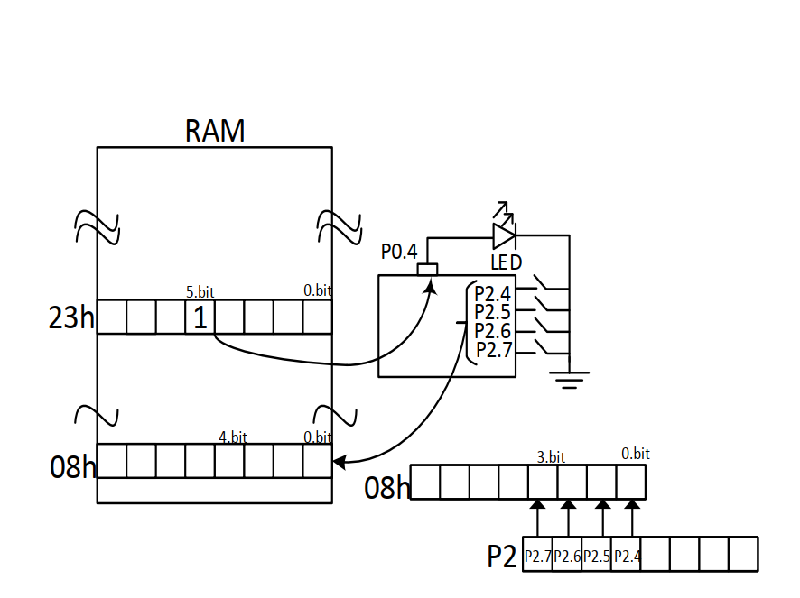

# Bit-Level Memory Manipulation and LED Control

<p align="left">
  
  
  
</p>

---

## 🎓 Project Information

| Field | Details |
| :--- | :--- |
| Course | EEM304 Microprocessors |
| Institution | Sakarya University |
| Term | Spring 2016 |
| Instructor | Asst. Prof. Zekiye Erdem |

## 📝 Overview
This project demonstrates the **bit-level addressing** capabilities of the ADuC841 microcontroller. It focuses on manipulating specific bits within the internal RAM to drive hardware outputs and mapping external switch states from Port 2 into designated bit locations within a memory byte (08h).



## 🎯 Objectives
* **Bit-Addressable RAM Access**: Directly modify the 5th bit of RAM address **23h**.
* **Direct Hardware Mapping**: Transfer a software-defined bit state to a physical pin (**P0.4**) to control an LED.
* **Port-to-Memory Bit Mapping**: Read a 4-bit nibble from **Port 2** (P2.4-P2.7) and re-map those bits into bit positions 0 through 3 of RAM address **08h**.

## ⚙️ Hardware Configuration & Pin Mapping

| Component | Pin / Port | Function |
| :--- | :--- | :--- |
| **LED** | **P0.4** | Visual output driven by RAM address 23h.5. |
| **Input Switches** | **P2.4 - P2.7** | Source bits for memory mapping into address 08h. |

### Memory Mapping
* **23h (Bit 5)**: Set to Logic 1 via bit-addressable command to trigger the LED.
* **08h (Bits 0-3)**: Target storage for bits retrieved from P2.4-P2.7.

## 🕹️ System Operation & Logic
1. **LED Control Phase**:
   - Initialize **Port 0** with `00h` to ensure all outputs start in a known state.
   - Access bit **23h.5** directly and set it to `1`.
   - Use the **Carry Flag (C)** as a bridge to move the state of bit **23h.5** to **P0.4**, illuminating the LED.
2. **Bit Re-mapping Phase**:
   - The system reads the logic states of pins **P2.4, P2.5, P2.6,** and **P2.7**.
   - Each pin state is moved sequentially into bit positions **0, 1, 2,** and **3** of RAM address **08h**.
   - This demonstrates how non-sequential hardware pins can be packed into a single memory byte.

## 🏗️ Program Structure
* **`INIT`**: Resets Port 0 and clears target RAM registers.
* **`BIT_LOGIC`**: Sets the bit in 23h and transfers it to the LED pin.
* **`MAPPING_LOGIC`**: Sequentially maps Port 2 pins to the target bits in address 08h.

## 💻 Source Code

> [!IMPORTANT]
> The following code is developed in 8051 Assembly for the Keil µVision environment. It follows the standard 8051 instruction set.

<details>
  <summary><b>📜 Click to View Source Code</b></summary>
  <br>

```assembly
; =============================================================================
; Project Name      : Bit-Level Memory Manipulation and LED Control
; Author            : Ali Ozkan
; Hardware          : ADuC841
; Description       : Manipulates RAM bit 23h.5 to drive P0.4 and maps 
;                     P2.4-P2.7 input bits into RAM address 08h (bits 0-3).
; =============================================================================

#include <ADUC841.H>

ORG 0000h

; -----------------------------------------------------------------------------
; PART A: BIT-ADDRESSABLE LED CONTROL
; -----------------------------------------------------------------------------
    MOV P0, #00h            ; Initialize Port 0 to clear all outputs
    SETB C                  ; Set Carry Flag to Logic 1 (Alternative to MOV PSW, #80h)
    MOV 1Ch, C              ; Move Carry to bit address 1Ch (corresponds to 23h.5)
    MOV P0, 23h             ; Update Port 0 with content of 23h (P0.4 becomes 1)

; -----------------------------------------------------------------------------
; PART B: PORT-TO-MEMORY NIBBLE MAPPING
; -----------------------------------------------------------------------------
    ANL P2, #0F0h           ; Mask lower nibble of P2, keeping only P2.4-P2.7
    MOV A, P2               ; Move P2 status to Accumulator
    SWAP A                  ; Swap nibbles: P2.4-P2.7 move to bits 0-3 positions
    MOV 08h, A              ; Store the re-mapped bits into RAM address 08h

END
```

</details>

## 🧪 Simulation & Testing (Keil µVision)

1. **Debug Mode**: Start simulation by pressing `Ctrl + F5`.
2. **Phase A Verification (Bit Control)**:
   - Check the **Memory Window** at address `D:0x23`. Bit 5 should be `1`.
   - Observe **Port 0**. Pin **P0.4** should be High, reflecting the value of `23h.5`.
3. **Phase B Verification (Mapping)**:
   - Open **Peripherals -> I/O Ports -> Port 2**.
   - Check the boxes for **P2.4 through P2.7** in various combinations.
   - Run the script and check RAM address `D:0x08`. 
   - Verify that the states of P2.4-P2.7 appear correctly in bits 0-3 of address 08h.

## 🛠 Installation & Execution

1. **Build**: Compile the project in Keil µVision to generate the `.hex` file.
2. **Flash**: Download the firmware to the ADuC841 using the **WSD Tool**.
3. **Hardware Test**:
   - Observe the LED on **P0.4**; it should light up immediately upon reset.
   - Use a debugger or logic analyzer to verify that toggling switches on **P2.4-P2.7** updates the bits in RAM address **08h**.