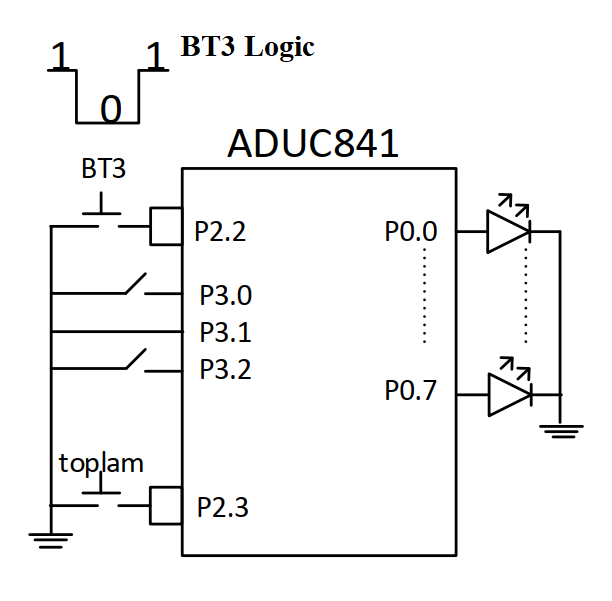

# Button Press Counter and Dynamic Sequential Summation

<p align="left">
  
  
  
</p>

---

## 🎓 Project Information

| Field | Details |
| :--- | :--- |
| Course | EEM304 Microprocessors |
| Institution | Sakarya University |
| Term | Spring 2016 |
| Instructor | Asst. Prof. Zekiye Erdem |

## 📝 Overview
This project implements a manual pulse counter and a recursive summation algorithm using the **ADuC841**. The system counts negative pulses from a tactile button (BT3), stores the count in internal RAM, and upon a "Sum" command (P2.3), calculates the total sum of all integers from the current count down to zero (e.g., if count=5, sum = 5+4+3+2+1).



## 🎯 Objectives
* **Pulse Detection**: Monitor **P2.2** for negative pulses using `JB` and `JNB` instructions.
* **Non-volatile Counting**: Store the Button Press (BS) count at RAM address **10h**.
* **Recursive Logic**: Implement a summation loop that decrements from the total count to zero.
* **Hardware Output**: Display the final summation result on **Port 0** using LEDs.

## ⚙️ Hardware Configuration & Pin Mapping

| Component | Pin / Port | Function |
| :--- | :--- | :--- |
| **BT3 (Counter)** | **P2.2** | Input for negative pulse detection (active low). |
| **Sum Button** | **P2.3** | Trigger to start the summation process. |
| **LED Array** | **Port 0 (P0)** | 8-bit output display for the summation result. |

### Memory Mapping
* **10h**: Stores the current Button Press (BS) count.
* **Accumulator (A)**: Used for calculating the running total during the summation phase.

## 🕹️ System Operation & Logic
1. **Initial State**: All LEDs on Port 0 are off.
2. **Pulse Counting**: The system continuously polls **P2.2**. Each time the button is pressed and released (detecting a 1 -> 0 -> 1 transition), the value at RAM address **10h** is incremented.
3. **Summation Trigger**: When **P2.3** is pressed, the system retrieves the value from **10h**.
4. **The Loop**: Using `JNZ` or `JZ` instructions, the system adds the current count to a total and decrements the count until it reaches zero.
5. **Reset**: After displaying the result on **Port 0**, the BS count at **10h** is reset to zero for the next cycle.

## 🏗️ Program Structure
* **`POLL_PULSE`**: Routine to detect the negative edge on P2.2.
* **`SUM_START`**: Triggered by P2.3 to begin mathematical operations.
* **`SUM_LOOP`**: The core logic that performs `total = total + count` and `count = count - 1`.
* **`OUTPUT_RESET`**: Updates Port 0 and clears the count in RAM.

## 💻 Source Code

> [!IMPORTANT]
> The following code is developed in 8051 Assembly for the Keil µVision environment. It follows the standard 8051 instruction set.

<details>
  <summary><b>📜 Click to View Source Code</b></summary>
  <br>

```assembly
; =============================================================================
; Project Name      : Button Press Counter and Dynamic Summation
; Author            : Ali Ozkan
; Hardware          : ADuC841
; Description       : Counts negative pulses on P2.2 and stores in RAM 10h. 
;                     Upon P2.3 trigger, sums integers from BS count to 1.
; =============================================================================

#include <ADUC841.H>

ORG 0000h
SJMP INIT

; -----------------------------------------------------------------------------
; INITIALIZATION SECTION
; -----------------------------------------------------------------------------
INIT:
    MOV P0, #00h                ; Initialize Port 0 (LEDs OFF)
    MOV 10h, #00h               ; Clear Button Press (BS) count at RAM 10h
    MOV A, #00h                 ; Clear Accumulator for summation

; -----------------------------------------------------------------------------
; PULSE DETECTION (P2.2 - BT3)
; -----------------------------------------------------------------------------
PUSH_CONTROL:
    JB P2.2, PUSH_CONTROL       ; Wait until BT3 (P2.2) is pressed (Logic 0)
    
PULL_CONTROL:    
    JNB P2.2, PULL_CONTROL      ; Wait until BT3 (P2.2) is released (Logic 1)
    
    INC 10h                     ; Increment BS count at RAM 10h after each pulse
    JB P2.3, PUSH_CONTROL       ; Continue counting until Sum Button (P2.3) is pressed

; -----------------------------------------------------------------------------
; SUMMATION LOGIC (Recursive Total)
; -----------------------------------------------------------------------------
    MOV R0, 10h                 ; Load BS count into R0 for the loop
    MOV A, #00h                 ; Reset Accumulator before starting summation

SUM_LOOP:
    ADD A, R0                   ; Add current count (R0) to total (A)
    DJNZ R0, SUM_LOOP           ; Decrement R0 and repeat until R0 = 0

; -----------------------------------------------------------------------------
; OUTPUT AND RESET
; -----------------------------------------------------------------------------
    MOV P0, A                   ; Display final summation result on Port 0 LEDs
    MOV 10h, #00h               ; Reset BS count for the next cycle

STOP:
    SJMP STOP                   ; Infinite loop to hold the result

END
```

</details>

## 🧪 Simulation & Testing (Keil µVision)

1. **Debug Mode**: Enter simulation by pressing `Ctrl + F5`.
2. **I/O Monitoring**: 
   - Open **Peripherals -> I/O Ports -> Port 2** to simulate buttons.
   - Open **Peripherals -> I/O Ports -> Port 0** to monitor the LED output.
3. **Step 1 (Pulse Counting)**: 
   - Toggle **P2.2** (uncheck then check) to simulate a button press and release.
   - Monitor RAM address **10h** (via Memory Window `D:0x10`) to see the count increment.
4. **Step 2 (Triggering Summation)**: 
   - Uncheck **P2.3** to simulate the "Sum" button press.
5. **Step 3 (Verification)**: 
   - Observe **Port 0**. If P2.2 was toggled 5 times, Port 0 must display **0Fh** (Decimal 15: 5+4+3+2+1).
   - Verify that RAM address **10h** is reset to **00h** after the process.

---

## 🛠 Installation & Execution

1. **Build**: Compile the source code in Keil µVision and ensure no errors are present to generate the `.hex` file.
2. **Flash**: Connect the ADuC841 development board to your PC and use the **WSD (Windows Serial Downloader)** tool to flash the hex file.
3. **Hardware Setup**:
   - Ensure BT3 is connected to **P2.2**.
   - Ensure the Summation button is connected to **P2.3**.
   - Connect an LED array or logic analyzer to **Port 0** to view the output.
4. **Operation**: Press BT3 several times, then press the Sum button to see the cumulative result displayed on the LEDs.