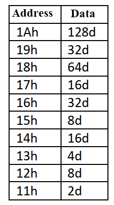

# Dynamic RAM Data Entry and Arithmetic Processor

<p align="left">
  
  
  
</p>

---

## 📝 Overview
This project focuses on automated RAM population and complex arithmetic operations using the **ADuC841**. The system writes a specific dataset to RAM addresses **11h through 1Ah** and performs a differential calculation based on even and odd address parity.



## 🎯 Objectives
* **Automated Data Entry**: Populate a 10-byte RAM block (11h-1Ah) using a loop-based power-of-two sequence.
* **Parity-Based Arithmetic**: Calculate the sum of data in even addresses and odd addresses separately.
* **Bitwise Division**: Use right-shift logic (or equivalent arithmetic) to find half-values of the calculated sums.
* **Optimization**: Implement the entire logic within a target limit of **40 code lines**.

## ⚙️ Hardware Configuration & Pin Mapping
This is a software-logic project executed within the internal MCU architecture. No external hardware peripherals are required for the primary calculation.

### Memory Mapping
| Address Range | Data Sequence (Decimal) | Function |
| :--- | :--- | :--- |
| **11h - 1Ah** | 2, 8, 4, 16, 8, 32, 16, 64, 32, 128 | Primary Data Block |
| **Working Registers** | R0 - R7 | Used for pointers and temporary sums |

## 🕹️ System Operation & Logic
1. **Data Entry Phase**:
   - A pointer starts at **11h**.
   - A loop writes the specific values from the provided table into the RAM block.
2. **Arithmetic Processing**:
   - The system iterates through the RAM block.
   - **Even Addresses**: Values are summed and the total is divided by 2.
   - **Odd Addresses**: Values are summed and the total is divided by 2.
3. **Final Result**:
   - The system subtracts the "half-sum of even addresses" from the "half-sum of odd addresses."
4. **Termination**:
   - The program enters an infinite wait state once the final result is stored in the Accumulator.

## 🏗️ Program Structure
* **`WRITE_LOOP`**: Initializes the RAM block with the predefined dataset.
* **`CALC_PARITY`**: Separates and sums data based on address parity.
* **`ARITHMETIC_FINISH`**: Performs division and subtraction to reach the final result.

## 💻 Source Code

> [!IMPORTANT]
> The following code is developed in 8051 Assembly for the Keil µVision environment. It follows the standard 8051 instruction set.

<details>
  <summary><b>📜 Click to View Source Code</b></summary>
  <br>

```assembly
; =============================================================================
; Project Name      : Dynamic RAM Data Entry and Arithmetic Processor
; Author            : Ali Ozkan
; Hardware          : ADuC841
; Description       : Automates RAM population (11h-1Ah) and calculates the 
;                     difference between half-sums of odd and even addresses.
; =============================================================================

#include <ADUC841.H>

ORG 0000h

; -----------------------------------------------------------------------------
; PHASE 1: DATA ENTRY (RAM POPULATION)
; -----------------------------------------------------------------------------
    MOV A,  #128d           ; Load decimal 128 into Accumulator
    MOV R0, #1Ah            ; Set pointer to the last RAM address (1Ah)
    MOV R1, #05h            ; Set loop counter for 5 pairs (10 bytes total)

PROCESS1:
    MOV @R0, A              ; Store current value (e.g., 128) to RAM address in R0
    DEC R0                  ; Decrement RAM pointer
    RR A                    ; Rotate right (effectively divide by 2)
    RR A                    ; Rotate right again (effectively divide by 4 total)
    MOV @R0, A              ; Store modified value (e.g., 32) to next RAM address
    DEC R0                  ; Decrement RAM pointer
    RL A                    ; Rotate left once to prepare next sequence start
    DJNZ R1, PROCESS1       ; Repeat until RAM block 11h-1Ah is populated

; -----------------------------------------------------------------------------
; PHASE 2: ARITHMETIC CALCULATION
; -----------------------------------------------------------------------------
    MOV A, #00h             ; Clear Accumulator for summation
    MOV R1, #1Bh            ; Set pointer just above the top address (1Ah)
    MOV R0, #05h            ; Set loop counter for 5 pairs

PROCESS2:
    DEC R1                  ; Point to odd address (1Ah, 18h, etc.)
    ADD A, @R1              ; Sum odd address values
    DEC R1                  ; Point to even address (19h, 17h, etc.)
    SUBB A, @R1             ; Subtract even address values
    DJNZ R0, PROCESS2       ; Repeat for all pairs

    RR A                    ; Divide the final result by 2 (Right Shift)
    MOV P0, A               ; Output the final result to Port 0

END
```

</details>

## 🧪 Simulation & Testing (Keil µVision)

1. **Debug Mode**: Start the simulation session by pressing `Ctrl + F5`.
2. **Memory Verification**: 
   - Open **View -> Memory Windows -> Memory 1**.
   - Type `D:0x11` in the Address bar and press Enter.
   - Run the code partially or step through to verify that the RAM block (11h-1Ah) is populated with the sequence: `02, 08, 04, 16, 08, 32, 16, 64, 32, 128`.
3. **Execution**: Press `F5` (Run) to complete the arithmetic calculations.
4. **Verification**: 
   - Open the **Port 0** window (**Peripherals -> I/O Ports -> Port 0**).
   - The output displayed on Port 0 represents the final calculated difference divided by two ($(\sum \text{Odd} - \sum \text{Even}) / 2$).

---

## 🛠 Installation & Execution

1. **Build**: Compile the project in Keil µVision to ensure there are no syntax errors and to generate the `.hex` file.
2. **Flash**: Connect your ADuC841 development board and use the **WSD (Windows Serial Downloader)** tool to upload the hex file.
3. **Execution**: Once flashed, the microcontroller will execute the program upon reset.
4. **Hardware Monitoring**: If physical LEDs are connected to Port 0, you can observe the binary representation of the final arithmetic result directly on the hardware.