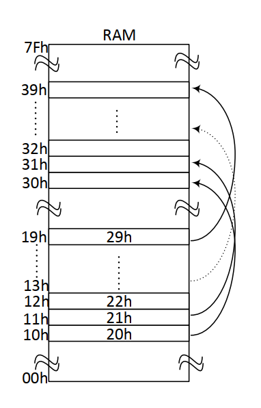

# Internal RAM Data Block Transfer with Indirect Addressing

<p align="left">
  
  
  
</p>

---

## 📝 Overview
This project implements an automated data migration within the ADuC841 internal RAM. The system transfers a sequence of pre-stored values from a source memory block (**10h–19h**) to a target destination block (**30h–39h**) using a loop-based iterative process.



## 🎯 Objectives
* **Indirect Addressing**: Utilize pointer registers (**R0** and **R1**) to navigate through non-sequential memory locations.
* **Block Migration**: Transfer 10 bytes of data safely between internal RAM sectors.
* **Loop Control**: Implement the **DJNZ** instruction for efficient iteration management and code minimization.

## ⚙️ Hardware Configuration & Pin Mapping
This project is an internal memory operation; therefore, no external I/O pins or hardware peripherals are required for the core logic execution.

### Memory Mapping
| Block Type | Address Range | Data Content (Hex) |
| :--- | :--- | :--- |
| **Source Block** | **10h - 19h** | 20h, 21h, 22h, ... 29h |
| **Destination Block** | **30h - 39h** | Target location for mirrored data |

## 🕹️ System Operation & Logic
1. **Pointer Initialization**:
   - Register **R0** is assigned as the source pointer, initialized to **10h**.
   - Register **R1** is assigned as the destination pointer, initialized to **30h**.
   - A register acts as the loop counter, set to **10** (0Ah).
2. **Transfer Loop**:
   - The value at the address pointed to by **R0** is moved to the **Accumulator** using indirect addressing.
   - The value in the **Accumulator** is then moved to the target address pointed to by **R1**.
   - Both pointers (**R0** and **R1**) are incremented to point to the next memory cells.
3. **Iteration**:
   - The **DJNZ** instruction decrements the counter and repeats the process until all 10 bytes are copied.

## 🏗️ Program Structure
* **`INIT`**: Sets up pointers and the iteration counter.
* **`MOVE_BLOCK`**: The iterative loop performing the actual data transfer between addresses.
* **`STOP`**: Termination loop to preserve the final memory state.

## 💻 Source Code

> [!IMPORTANT]
> The following code is developed in 8051 Assembly for the Keil µVision environment. It follows the standard 8051 instruction set.

<details>
  <summary><b>📜 Click to View Source Code</b></summary>
  <br>

```assembly
; =============================================================================
; Project Name      : Internal RAM Data Block Transfer
; Author            : Ali Ozkan
; Hardware          : ADuC841
; Description       : Populates RAM 10h-19h with values and transfers them 
;                     to 30h-39h using indirect addressing and loop control.
; =============================================================================

#include <ADUC841.H>

ORG 0000h
SJMP INIT

; -----------------------------------------------------------------------------
; PHASE 1: DATA INITIALIZATION (LOADING 10h-19h)
; -----------------------------------------------------------------------------
INIT:
    MOV R0, #19h            ; Set pointer to the end of source block (19h)
    MOV R1, #0Ah            ; Set loop counter for 10 bytes
    MOV A,  #2Ah            ; Initial value to be decremented and stored

LOAD:
    DEC A                   ; Decrement value
    MOV @R0, A              ; Store value in current RAM address pointed by R0
    DEC R0                  ; Move pointer to the previous address
    DJNZ R1, LOAD           ; Repeat until source block is populated

; -----------------------------------------------------------------------------
; PHASE 2: DATA TRANSFER (MIGRATION TO 30h-39h)
; -----------------------------------------------------------------------------
    MOV R0, #3Ah            ; Set destination pointer (starts from 39h via DEC)
    MOV R1, #19h            ; Set source pointer (starts from 19h)
    MOV R2, #0Ah            ; Set loop counter for 10 bytes

TRANSFER:
    DEC R0                  ; Decrement destination pointer (3Ah -> 39h...)
    MOV A, @R1              ; Read data from source address pointed by R1
    DEC R1                  ; Decrement source pointer (19h -> 18h...)
    MOV @R0, A              ; Write data to destination address pointed by R0
    DJNZ R2, TRANSFER       ; Repeat until all 10 bytes are transferred

END
```

</details>

## 🧪 Simulation & Testing (Keil µVision)

1. **Debug Mode**: Start the simulation session by pressing `Ctrl + F5`.
2. **Memory View Setup**: 
   - Open **View -> Memory Windows -> Memory 1** and type `D:0x10`.
   - Open **View -> Memory Windows -> Memory 2** and type `D:0x30`.
3. **Step-by-Step Verification**:
   - Step through the **LOAD** loop: Verify addresses **10h-19h** are filled with values from **29h down to 20h**.
   - Step through the **TRANSFER** loop: Observe the values being copied from the 10h block to the 30h block.
4. **Final Verification**: 
   - After the program reaches `END`, confirm that memory range **30h-39h** is an exact mirror of **10h-19h**.

## 🛠 Installation & Execution

1. **Build**: Compile the project in Keil µVision to ensure zero errors and generate the `.hex` file.
2. **Flash**: Use the **WSD (Windows Serial Downloader)** tool to upload the firmware to the ADuC841.
3. **Execution**: The microcontroller will perform the memory population and transfer immediately upon reset.
4. **Validation**: Use a debugger to read the internal RAM content to confirm the successful block migration on physical hardware.