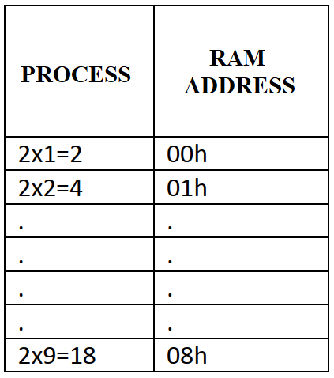

# Single-Table Multiplication Generator (2s)

<p align="left">
  
  
  
</p>

---

## 🎓 Project Information

| Field | Details |
| :--- | :--- |
| Course | EEM304 Microprocessors |
| Institution | Sakarya University |
| Term | Spring 2016 |
| Instructor | Asst. Prof. Zekiye Erdem |

## 📝 Overview
This project focuses on basic arithmetic automation and linear memory storage using the **ADuC841**. The system calculates the multiplication table of 2 (from 2x1 to 2x9) and saves the results in consecutive internal RAM addresses from **00h to 08h** using a `DJNZ`-based loop structure.



## 🎯 Objectives
* **Linear RAM Storage**: Map results to a specific, sequential memory block (00h-08h).
* **Loop Implementation**: Use the `DJNZ` (Decrement and Jump if Not Zero) instruction for iteration control.
* **Arithmetic Logic**: Implement repeated addition or multiplication to generate the table of 2.

## ⚙️ Hardware Configuration & Pin Mapping
This is a software-centric project executed within the MCU's internal architecture. No external hardware components are required.

### Memory Mapping
| Result | RAM Address | Value (Decimal) |
| :--- | :--- | :--- |
| 2 x 1 | **00h** | 2 |
| 2 x 2 | **01h** | 4 |
| ... | ... | ... |
| 2 x 9 | **08h** | 18 |

## 🕹️ System Operation & Logic
1. **Pointer Setup**: Register `R0` is initialized to the starting address **00h**.
2. **Loop Counter**: A register (e.g., `R7`) is loaded with the value **9** to track iterations.
3. **Calculation**: The system starts with the value 2. In each subsequent loop, it adds 2 to the previous result.
4. **Storage**: Data is written to RAM using indirect addressing (`MOV @R0, A`).
5. **Termination**: After 9 iterations, the `DJNZ` instruction ends the loop, and the program enters an infinite wait state.

## 🏗️ Program Structure
* **`INIT`**: Sets the starting RAM pointer (00h) and iteration counter (9).
* **`CALC_LOOP`**: The core loop that handles addition, stores data, and increments the pointer.
* **`STOP`**: An infinite loop that preserves the final RAM state.

## 💻 Source Code

> [!IMPORTANT]
> The following code is developed in 8051 Assembly for the Keil µVision environment. It follows the standard 8051 instruction set.

<details>
  <summary><b>📜 Click to View Source Code</b></summary>
  <br>

```assembly
; =============================================================================
; Project Name		: Multiplication Table of 2 (RAM Mapping)
; Author			: Ali Ozkan
; Hardware			: ADuC841 (Internal RAM Processing)
; Description		: Calculates 2x1 through 2x9 and stores results in RAM 00h-08h.
; =============================================================================

#include <ADUC841.H>

ORG 0000h
SJMP INIT

; -----------------------------------------------------------------------------
; INITIALIZATION
; -----------------------------------------------------------------------------
INIT:
    MOV PSW, #08h               ; RS0=1, RS1=0: Select Register Bank 1
                                ; This moves R1 and R7 away from the 00h-07h range.
    MOV R1, #00h                ; Pointer for RAM address 00h
    MOV A, #02h                 ; First result: 2x1 = 2
    MOV R7, #09h                ; Loop counter for 9 iterations

; -----------------------------------------------------------------------------
; CALCULATION & STORAGE LOOP
; -----------------------------------------------------------------------------
PROCESS:
    MOV @R1, A                  ; Store result in RAM (Bank 0 area)
    ADD A, #02h                 ; Next multiple of 2
    INC R1                      ; Next RAM address
    DJNZ R7, PROCESS            ; Repeat. Counter R7 is now at address 0Fh, safe!

; -----------------------------------------------------------------------------
; TERMINATION (Infinite Loop)
; -----------------------------------------------------------------------------
STOP:
    SJMP STOP                   ; Stay in an infinite loop to preserve RAM data

END
```

</details>

## 🧪 Simulation & Testing (Keil µVision)

1.  **Debug Mode**: Enter simulation using `Ctrl+F5`.
2.  **Memory View**: Open **View -> Memory Windows -> Memory 1** and type `D:0x00`.
3.  **Run**: Press **F5**.
4.  **Observation**: 
    * Address **00h** should contain `02`.
    * Address **01h** should contain `04`.
    * ...
    * Address **08h** should contain `12` (Hexadecimal for 18).

## 🛠 Installation & Execution
1. Open the project in Keil µVision.
2. Build the target to generate the `.hex` file.
3. Use the WSD tool to flash the code to the ADuC841.
4. Verify the results via a debugger or by checking the internal memory state.